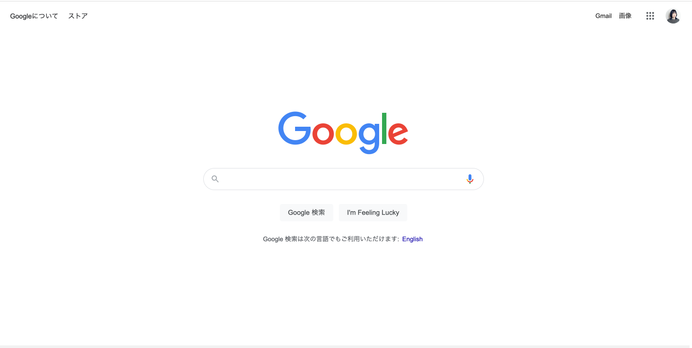

# 製作問題
モックアップ (mock-up) とは「模型」という意味を持ちます。 
下記の要件を満たすGoogleの検索サイトのモックアップを作成してください。 
（添付の画像を参考に作成してください）

## 
* リポジトリ内にフォルダを作成し、要件に満たすものを提出してください
* ヘッダーがあり、画面の中央にタイトル・入力欄・ボタン２つが縦に並ぶように設置してください
* タイトルについては画像の挿入で結構です
* 入力欄に検索機能をつける必要はありません
* 入力欄またはボタンを動作させた結果をコンソール画面で確認できるようにしてください 
（例えば、ボタンを押すと"click" と表示される、入力欄に入れた文字が出力されるなど）
* 動作をつける箇所は一箇所以上あれば結構です
* CSSについては装飾がついているかどうかではなく、正しい位置やバランスになっているかを評価対象とします

